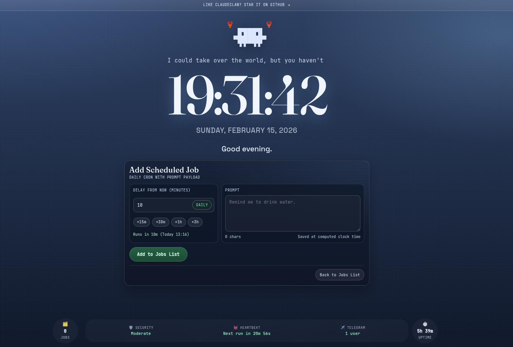

# ClaudeClaw

**A lightweight, open-source OpenClaw version built into your Claude Code.**

ClaudeClaw turns your Claude Code into a personal assistant that never sleeps. It runs as a background daemon, executing tasks on a schedule, responding to messages on Telegram, transcribing voice commands, and integrating with any service you need.



## Why ClaudeClaw?

**Zero API overhead.** No separate API keys, no token accounting, no billing surprises. Runs entirely within your Claude Code subscription with smart context management.

**Deploy in minutes.** One plugin install and one command gets you a running daemon with Telegram. No containers, no infrastructure, no dependency headaches.

**Built-in observability.** A web dashboard to monitor runs, edit scheduled jobs, and inspect logs in real time.

## Getting Started — 5 Minutes

```bash
claude plugin marketplace add moazbuilds/claudeclaw
claude plugin install claudeclaw
```
Then open a Claude Code session and run:
```
/claudeclaw:start
```
The setup wizard walks you through model, heartbeat, Telegram, and security — then your daemon is live with a web dashboard.

## Features

- **Heartbeat** — periodic check-ins on a configurable interval with quiet hours support
- **Cron Jobs** — schedule any prompt with standard cron syntax, timezone-aware
- **Telegram Bot** — chat with your agent from anywhere with text, images, and voice
- **Web Dashboard** — monitor runs, edit jobs, view logs in real time
- **Security Levels** — four granular levels from read-only to full system access
- **Model Selection** — choose between Opus, Sonnet, or Haiku per project
